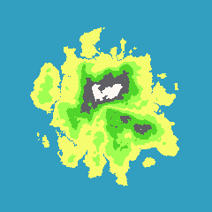

# A simple library for creating pixel islands
This utility uses Perlin Noise and standard mathematical functions to create primitive pixel islands.

# Help
In the main file.go contains all the main functions.

> This is just an example of my implementation, which you can always customize for yourself.

# Example
1. [120 radius](120radius.png)
2. [750 radius](750radius.png)
